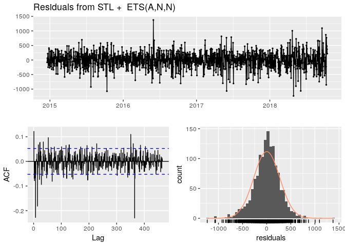
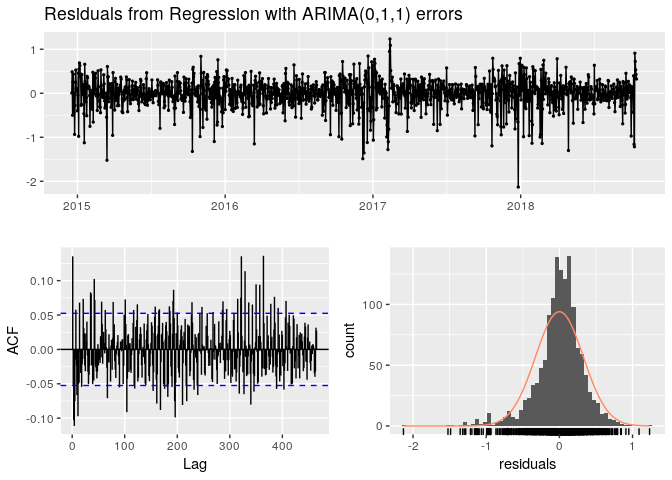
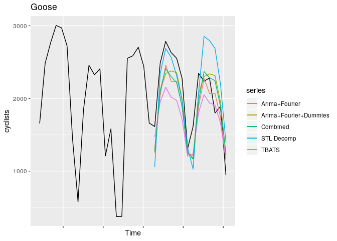

predict the goose
================

Plot the whole series and just 2018
-----------------------------------

SLT Decomposition
-----------------

Of the whole series, assuming weekly and yearly seasonality.

forecast based on stlf
----------------------

    ##                      ME     RMSE      MAE       MPE     MAPE      MASE
    ## Training set   1.524802 270.9244 203.3014 -5.647543 18.82872 0.4327295
    ## Test set     -38.384961 434.9618 361.8238 -3.455903 20.14595 0.7701463
    ##                   ACF1 Theil's U
    ## Training set 0.1230271        NA
    ## Test set     0.5073740 0.7646251

Check stlf residuals
--------------------

    ## 
    ##  Ljung-Box test
    ## 
    ## data:  Residuals from STL +  ETS(A,N,N)
    ## Q* = 673.04, df = 277.2, p-value < 2.2e-16
    ## 
    ## Model df: 2.   Total lags used: 279.2

Forecast based on Dynamic harmonic regression
---------------------------------------------

    ##                     ME     RMSE      MAE       MPE     MAPE      MASE
    ## Training set  22.10053 396.4420 307.0416 -6.327679 25.76352 0.6535416
    ## Test set     210.83146 311.3347 283.4240  8.672156 14.09587 0.6032714
    ##                   ACF1 Theil's U
    ## Training set 0.1849538        NA
    ## Test set     0.1319632 0.5857492

check Dynamic harmonic regression residuals
-------------------------------------------

    ## 
    ##  Ljung-Box test
    ## 
    ## data:  Residuals from Regression with ARIMA(0,1,1) errors
    ## Q* = 697.41, df = 269.2, p-value < 2.2e-16
    ## 
    ## Model df: 10.   Total lags used: 279.2

Combine the two forecasts
-------------------------

    ##                ME     RMSE      MAE      MPE    MAPE      ACF1 Theil's U
    ## Test set 86.22325 329.3824 295.7657 2.608127 15.8108 0.4166697 0.6046255

