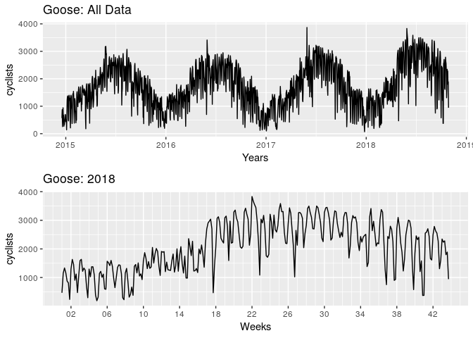
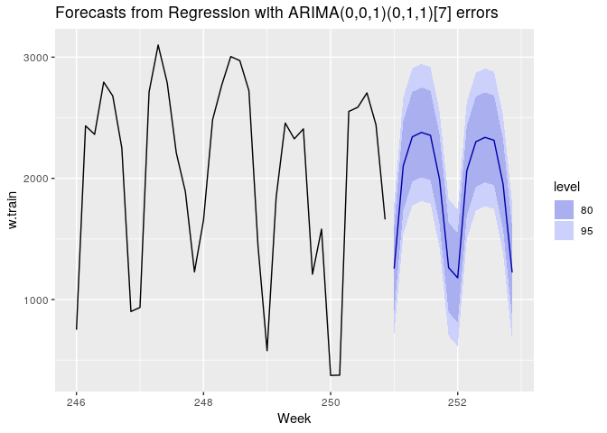
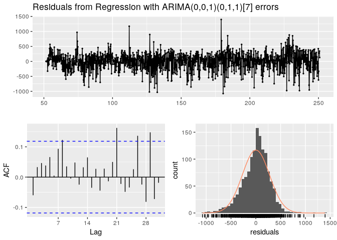

predict the goose
================

Plot the whole series and just 2018
-----------------------------------

SLT Decomposition
-----------------

Of the whole series, assuming weekly and yearly seasonality.

forecast based on stlf
----------------------

    ##                      ME     RMSE      MAE       MPE     MAPE      MASE
    ## Training set   1.524802 270.9244 203.3014 -5.647543 18.82872 0.4327295
    ## Test set     -38.384961 434.9618 361.8238 -3.455903 20.14595 0.7701463
    ##                   ACF1 Theil's U
    ## Training set 0.1230271        NA
    ## Test set     0.5073740 0.7646251

    ## 
    ##  Ljung-Box test
    ## 
    ## data:  Residuals from STL +  ETS(A,N,N)
    ## Q* = 673.04, df = 277.2, p-value < 2.2e-16
    ## 
    ## Model df: 2.   Total lags used: 279.2

Forecast based on Dynamic harmonic regression
---------------------------------------------

    ##                     ME     RMSE      MAE       MPE     MAPE      MASE
    ## Training set  22.10053 396.4420 307.0416 -6.327679 25.76352 0.6535416
    ## Test set     210.83146 311.3347 283.4240  8.672156 14.09587 0.6032714
    ##                   ACF1 Theil's U
    ## Training set 0.1849538        NA
    ## Test set     0.1319632 0.5857492

    ## 
    ##  Ljung-Box test
    ## 
    ## data:  Residuals from Regression with ARIMA(0,1,1) errors
    ## Q* = 697.41, df = 269.2, p-value < 2.2e-16
    ## 
    ## Model df: 10.   Total lags used: 279.2

forecast based on TBATS
-----------------------

    ##                      ME     RMSE      MAE      MPE     MAPE      MASE
    ## Training set   9.205277 333.8080 254.3901 -8.79447 24.41390 0.5414724
    ## Test set     321.993898 417.4721 369.0865 13.13185 17.33003 0.7856049
    ##                      ACF1 Theil's U
    ## Training set -0.001343788        NA
    ## Test set      0.258109639 0.7363362

    ## 
    ##  Ljung-Box test
    ## 
    ## data:  Residuals from TBATS(1, {3,1}, -, {<7,2>, <365.25,6>})
    ## Q* = 363.42, df = 249.2, p-value = 3.048e-06
    ## 
    ## Model df: 30.   Total lags used: 279.2

Arima with fourier for annual and holiday dummies
-------------------------------------------------

    ## Note: method with signature 'timeDate#numeric' chosen for function '-',
    ##  target signature 'timeDate#Period'.
    ##  "ANY#Period" would also be valid

    ##                      ME     RMSE      MAE        MPE     MAPE      MASE
    ## Training set   1.720426 388.2511 294.9296 -11.490982 27.74386 0.7796668
    ## Test set     204.791378 535.5297 447.2650   3.894603 24.40478 1.1823760
    ##                     ACF1 Theil's U
    ## Training set -0.03849532        NA
    ## Test set      0.45367469  1.009078

    ## 
    ##  Ljung-Box test
    ## 
    ## data:  Residuals from Regression with ARIMA(5,1,1) errors
    ## Q* = 327.95, df = 3, p-value < 2.2e-16
    ## 
    ## Model df: 28.   Total lags used: 31

Combine the forecasts
---------------------

    ##                ME     RMSE      MAE      MPE     MAPE      ACF1 Theil's U
    ## Test set 211.2991 404.4188 312.9664 8.180351 14.37878 0.2756185  0.679276
